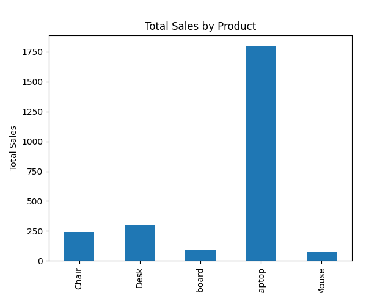

# 📊 Sales Data Analysis

This is my first data analysis project using Python and Pandas.

## 🔍 Project Description
In this project, I analyzed a simple sales dataset to understand product performance and total revenue.

## 🛠️ Tools Used
- Python
- Pandas
- Matplotlib

## 📈 Key Insights
- Laptop has the highest sales
- Mouse has the lowest sales
- Total revenue was calculated successfully

## 📊 Visualization


## 📁 Files
- main.py → analysis code
- data.csv → dataset
- chart.png → visualization

## 🚀 How to Run
```bash
py main.py
